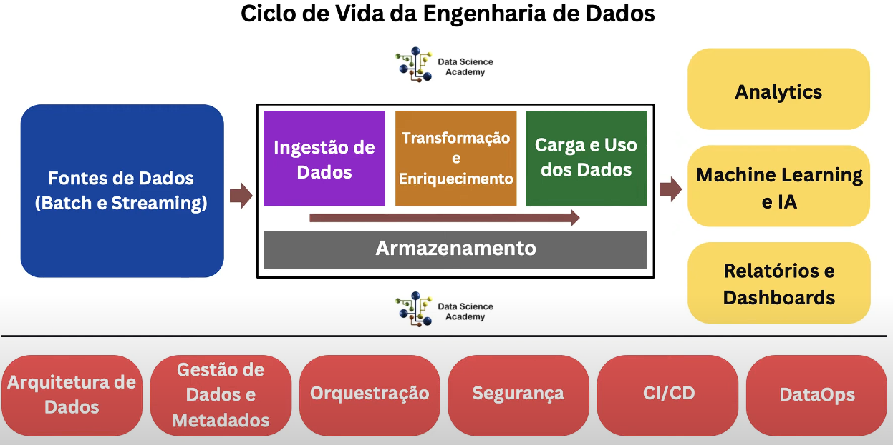

# Ciclo de vida da engenharia de dados.

É preciso manter os dados pra sempre ? Não, eles tem uma vida útil para empresa. 

Os dados podem ser extraídos em batch (lote), como extrair de um banco de dados realizar o processamento e entregar. Streaming é resgatar os dados à medida que estão sendo gerados. 

Uma vez que definiu a fontes dos dados , tem a ingestão de dados. Tirar os dados da origem e  fazer a ingestão na plataforma de dados, como apache hadoop por exemplo, para continuar o processo e pipeline de dados. Airbyte 

Transformação e enriquecimento -> Limpeza, organização dos dados. Enriquecimento , por exemplo, é colocar dados em contexto, twitter, extraiu dados de post e avalia para ver sentimento do usuario. Só que os dados dos post não estão claros se refere a uma campanha publicitaria da empresa, ou a outra coisa. Além de coletar os dados , ela vai no sistema interno extrai dados de marketing e acopla com  os dados extraídos das redes sociais. 

Carga e uso dos dados. Carrega no destino, ou usa os dados. Uma vez que concluiu a etapa de tranformação, toma a decisão de armazenar , ou ja usar os dados para analise. Ou analisa os dados , faz backup e armazena.

Durante a transformação e enriquecimento, onde estão os dados ? Dados são ativos digitais, existem em algum lugar, os dados estaram em um sistema de armazenamento, no minimo intermediario. 

Se uma empresa extrai os dados brutos  e faz a ingestão desses dados brutos, geralmente o armazenamento desses dados será feito em um datalake.