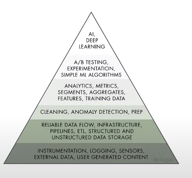

# O que é engenharia de dados ?

* Fontes de dados -> Engenharia de dados -> Analista de dados.

Pega os dados brutos , transforma , processa e entrega para analistas, cientistas e engenheiros de IA. 

## Definição formal 

É a tarefa complexa de tornar os dados brutos utilizáveis para Cientistas de Dados e grupos dentro de uma organização. Raramente, os dados estarão prontos para uso na fonte.

Ajuda a tornar os dados mais úteis e acessíveis para os consumidores de dados. 

É o processo usado para coletar e validar dados de qualidade que possam ser usados por Analistas e cientistas de dados.

Engenharia de dados é um conjunto de tecnicas e procedimentos para tornar os dados disponíveis para uso em um formato utilizável.

Trabalha com :

*   Infraestrutura de dados.
*   Mineração de dados.
*   Processamento de dados.
*   Aquisição.
*   Modelagem.
*   Gerenciamento.

Os dados são uma parte importante para dimensionar negócios, é como um ativo corporativo. A engenharia de dados fornece a matéria prima. Data-driven, decisões tomadas com base em dados e não em achismos. Para ter uma boa cultura data-driven, é preciso ter uma matéria prima de excelente qualidade. 

*   Hierarquia de necessidades em Data Science

Dados da matéria prima, subindo até a etapa da inteligência artificial. A engenharia de dados é o fundamento para ciência de dados. 