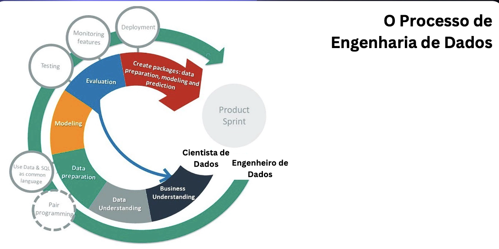

# O processo de Engenharia de Dados

Cada empresa procura uma forma de implementar a solução, não há uma formula única.

A linha verde é trabalho do engenheiro de dados e a linha interna é a do cientista de dados. A engenharia de dados participa de todo o processo mais tem a participação em etapas onde a gestão é crítica. 

A engenharia de dados fornece o suporte necessário para que o trabalho de cientista de dados funcione.  Participa da gestão do processo.

Extração de dados em  batch ou streaming

Preparação  dos dados com limpeza, tranformação , enriquecimento e segurança de acesso. 

Armazenamento dos dados no destino ou uso em tempo real

Análise, gráficos, dashboards, Machine Learning, IA 

O pipeline de dados pode ser executado uma vez ou várias vezes. 

A execução do pipeline requer monitoramento, segurança, validação e documentação.

O pipeline então é criado , documentado e automatizado.

